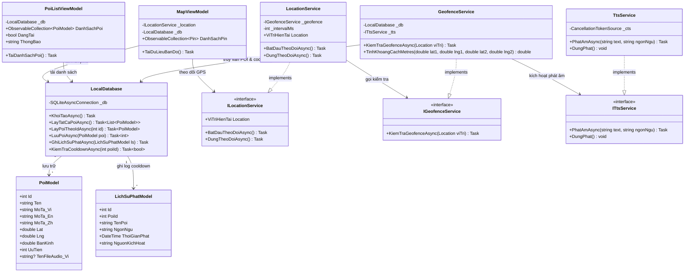
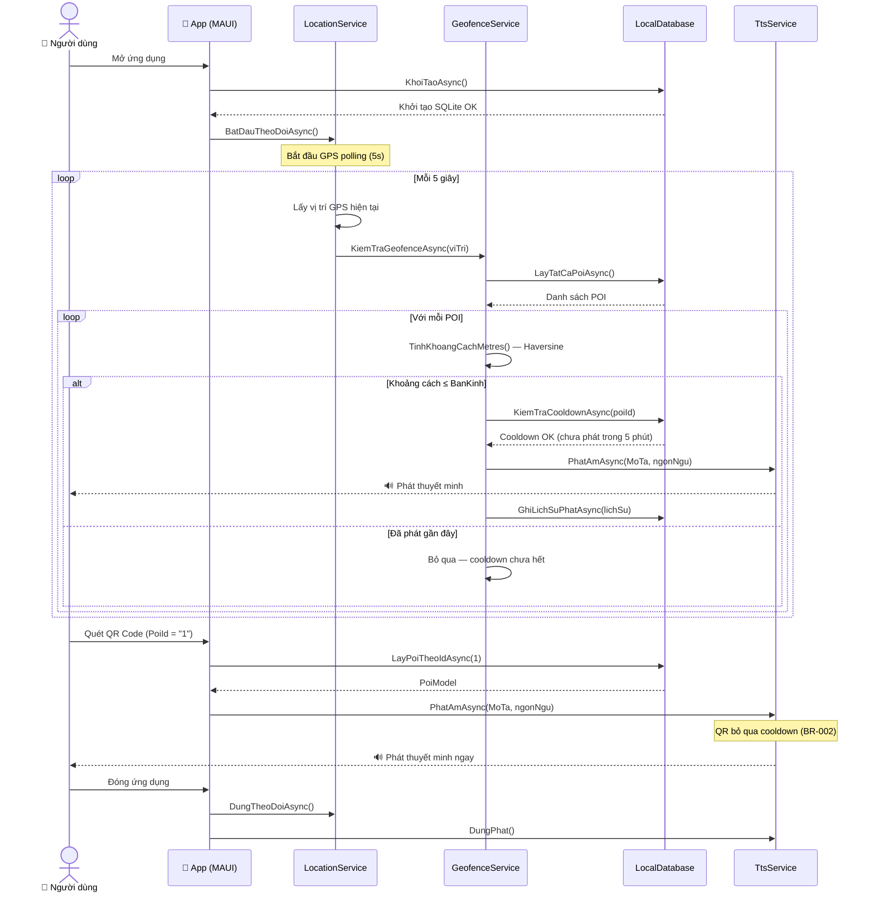
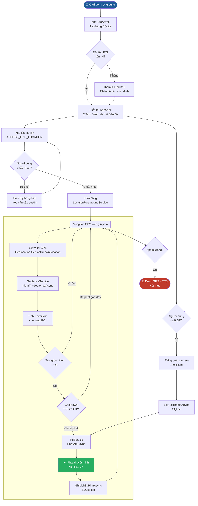
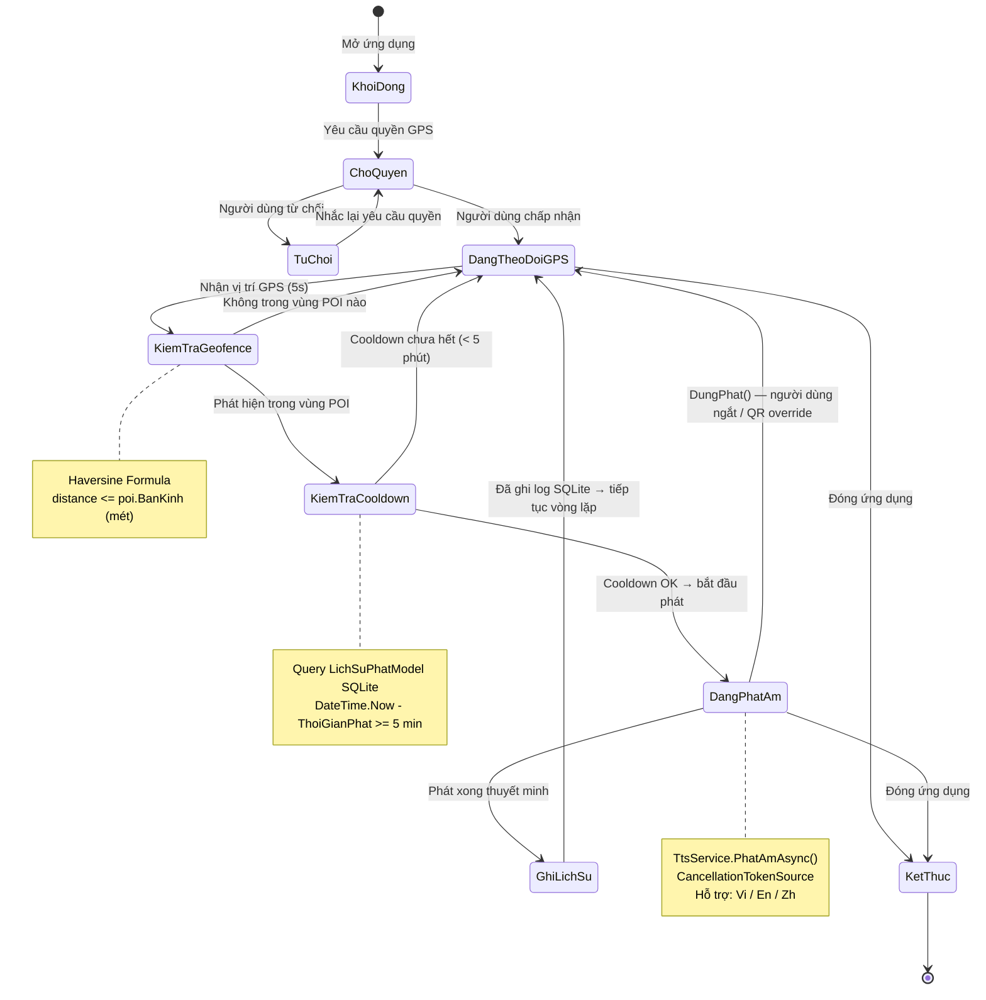

# 🍜 Vĩnh Khánh Audio Guide App

**Product Requirements Document (PRD) v1.0**

> Ứng dụng di động: Thuyết minh tự động đa ngôn ngữ — Phố ẩm thực Vĩnh Khánh

---

## Thông tin tài liệu

| Trường | Giá trị |
|---|---|
| Tên sản phẩm | Vĩnh Khánh Audio Guide App |
| Phiên bản | 1.0 (MVP) |
| Ngày lập tài liệu | 27/03/2026 |
| Trạng thái | Bản nháp cho Development |
| Người sở hữu (Owner) | Trần Trọng Duy Khiêm & Nguyễn Công Vinh |
| Đối tượng đọc | Development Team, Giảng viên hướng dẫn (Stakeholder) |

---

## Mục lục

0. [Quy trình kiểm tra trước khi gửi code (bắt buộc)](#0-quy-trinh-kiem-tra-truoc-khi-gui-code-bat-buoc)
1. [Executive Summary](#1-executive-summary)
2. [Scope Definition](#2-scope-definition)
3. [User Personas & Roles](#3-user-personas--roles)
4. [User Stories](#4-user-stories)
5. [Detailed Functional Requirements](#5-detailed-functional-requirements)
6. [Acceptance Criteria](#6-acceptance-criteria)
7. [Non-Functional Requirements](#7-non-functional-requirements)
8. [Data Requirements](#8-data-requirements)
9. [Business Rules](#9-business-rules)
10. [Technical Constraints](#10-technical-constraints)
11. [Dependencies & Integrations](#11-dependencies--integrations)
12. [Class Diagram](#12-class-diagram)
13. [Sequence Diagram](#13-sequence-diagram)
14. [Activity Diagram](#14-activity-diagram)
15. [State Diagram](#15-state-diagram)
16. [Success Criteria & Acceptance](#16-success-criteria--acceptance)
17. [Appendix — Glossary](#17-appendix--glossary)

---

## Thiết lập Google Maps Android

Để hiển thị bản đồ Google Maps trên Android, cập nhật API key trong file:

- `App/App/Platforms/Android/Resources/values/google_maps_api.xml`

Thay giá trị `REPLACE_WITH_GOOGLE_MAPS_API_KEY` bằng API key thật đã bật **Maps SDK for Android** trong Google Cloud Console.

---

## 0. Quy trình kiểm tra trước khi gửi code (bắt buộc)

> Áp dụng cho backend `VinhKhanhApi` để tránh gửi code lỗi build/test cơ bản.

### 0.1 Chạy local trước khi commit

- **Windows (PowerShell):**

```powershell
.\VinhKhanhApi\scripts\validate.ps1
```

- **Linux/macOS (bash):**

```bash
bash ./VinhKhanhApi/scripts/validate.sh
```

Script sẽ chạy theo thứ tự:
1. `dotnet restore`
2. `dotnet build --configuration Release -warnaserror`
3. `dotnet test --configuration Release`

Nếu bất kỳ bước nào fail thì **không được gửi code**.

### 0.2 CI tự động trên GitHub Actions

Repo đã có workflow `VinhKhanhApi CI` (`.github/workflows/vinhkhanhapi-ci.yml`) để chạy lại restore/build/test ở mọi `push` và `pull_request`.

## 1. Executive Summary

### 1.1 Tổng quan (Overview)

Vĩnh Khánh Audio Guide là một ứng dụng di động Android được phát triển bằng **.NET MAUI**. Ứng dụng cung cấp trải nghiệm hướng dẫn viên du lịch ảo bằng cách **tự động phát thuyết minh đa ngôn ngữ (Việt, Anh, Trung)** khi du khách đi ngang qua các điểm tham quan / quán ăn (POIs) tại phố ẩm thực Vĩnh Khánh, Quận 4, TP.HCM.

### 1.2 Mục tiêu (Goals)

**Mục tiêu chính:** Cung cấp trải nghiệm nghe thuyết minh rảnh tay (hands-free) hoàn toàn tự động dựa trên vị trí GPS của người dùng với cơ chế hoạt động **Offline-first**.

**Mục tiêu phụ:**

- Áp dụng kiến trúc phần mềm phân lớp (Layered Architecture) để Decoupling hoàn toàn hệ thống.
- Ngăn chặn việc phát âm thanh trùng lặp hoặc spam bằng thuật toán **Cooldown 5 phút** lưu trữ bền vững bằng SQLite.
- Hỗ trợ 3 ngôn ngữ TTS: **Việt, Anh, Trung**.

---

## 2. Scope Definition

### 2.1 Trong phạm vi (In-Scope — MVP v1.0)

**Module 1: Bản đồ & Định vị (Map & GPS)**
- Hiển thị bản đồ với các ghim POI (Microsoft.Maui.Controls.Maps).
- Lấy vị trí GPS liên tục 5 giây/lần (Android Foreground Service chạy ngầm).

**Module 2: Động cơ Geofence & Audio (Geofence & Narration Engine)**
- Tính khoảng cách GPS bằng thuật toán **Haversine**.
- Tự động kích hoạt Text-To-Speech (TTS) khi khoảng cách <= Bán kính POI.
- Áp dụng **Cooldown 5 phút** lưu trữ vĩnh viễn bằng SQLite.
- Hỗ trợ 3 ngôn ngữ TTS: Việt, Anh, Trung.

**Module 3: Quét mã QR (QR Scanner)**
- Quét mã dán tại quán bằng camera (thư viện ZXing) để phát âm thanh ngay lập tức (bỏ qua GPS).

**Module 4: Lưu trữ & Đồng bộ (Storage & Sync)**
- Lưu trữ offline 100% bằng SQLite (POIs, LichSuPhat).
- Đồng bộ (GET) dữ liệu POI từ Backend ASP.NET Core khi có mạng.

### 2.2 Ngoài phạm vi (Out-of-Scope)

- CMS Web Dashboard để nhập liệu (project riêng biệt, không thuộc scope mobile app).
- Hệ thống dẫn đường (Routing / Navigation).
- Đăng nhập / Đăng ký người dùng (App dành cho khách vãng lai, mở lên là dùng).

---

## 3. User Personas & Roles

### 3.1 Chân dung chính: Khách du lịch (Tourist)

| Thuộc tính | Chi tiết |
|---|---|
| Tên đại diện | Minh / John / Wei |
| Vai trò | Người dùng cuối (End-user) |
| Độ tuổi | 15 – 60 |
| Trình độ công nghệ | Cơ bản (biết dùng bản đồ và quét QR) |
| Mục tiêu | Hiểu lịch sử các quán ăn tại Vĩnh Khánh mà không cần cắm mặt đọc điện thoại |
| Pain Points | Không có internet (khách quốc tế), app ngốn pin quá nhanh, âm thanh phát lộn xộn |

---

## 4. User Stories

| ID | Module | User Story | Priority | AC ID |
|---|---|---|---|---|
| US-001 | Map | Là người dùng, tôi muốn thấy vị trí của mình và các quán ăn trên bản đồ để biết mình đang ở đâu. | P0 (Must) | AC-001 |
| US-002 | Geofence | Là người dùng, tôi muốn app tự phát âm thanh khi đến gần quán ăn để không phải thao tác tay. | P0 (Must) | AC-002 |
| US-003 | Audio | Là người dùng, tôi muốn không bị nghe lặp lại 1 quán ăn liên tục nếu tôi đứng yên tại đó. | P0 (Must) | AC-003 |
| US-004 | QR | Là người dùng, tôi muốn quét mã QR tại bàn để nghe thuyết minh ngay lập tức. | P1 (Should) | AC-004 |
| US-005 | Sync | Là người dùng, tôi muốn app vẫn chạy tốt khi tôi tắt 4G/Wifi (Offline). | P0 (Must) | AC-005 |

> *P0 = Bắt buộc cho MVP, P1 = Nên có*

---

## 5. Detailed Functional Requirements

### 5.1 Module 1: Bản đồ & Định vị (FR-MAP)

**FR-MAP-001: Hiển thị bản đồ (Interactive Map Display)**
- **Mô tả:** Sử dụng `Microsoft.Maui.Controls.Maps`, hiển thị các Pin tại tọa độ POI.
- **Hành vi:** Tâm bản đồ mặc định tại tọa độ Vĩnh Khánh (10.757, 106.690). Hiển thị real-time Card "Bạn đang gần: [Tên Quán] — Cách [X] mét" cập nhật mỗi 5 giây.

### 5.2 Module 2: Động cơ Geofence (FR-GEO)

**FR-GEO-001: Xử lý tọa độ & Kích hoạt (Haversine Trigger)**
- **Mô tả:** `GeofenceService` nhận tọa độ từ `ILocationService`, chạy vòng lặp tính khoảng cách Haversine.
- **Hành vi:** Nếu khoảng cách <= `poi.BanKinh` → đẩy vào `ITtsService`.
- **Business Rule:** Phải kiểm tra bảng `LichSuPhat` trong SQLite trước khi phát. Nếu `DateTime.Now - ThoiGianPhat < 5 phút` → Từ chối kích hoạt (Chống Spam).

### 5.3 Module 3: Âm thanh (FR-AUDIO)

**FR-AUDIO-001: Phát thuyết minh đa ngôn ngữ**
- **Mô tả:** `TtsService` xác định ngôn ngữ thiết bị (`vi` / `en` / `zh`) để lấy `MoTa` tương ứng từ POI.
- **Hành vi:** Dùng `CancellationTokenSource` để hủy phát giữa chừng khi cần. Không phát 2 luồng TTS cùng lúc.

### 5.4 Module 4: Quét QR (FR-QR)

**FR-QR-001: Quét mã QR kích hoạt thuyết minh**
- **Mô tả:** Camera quét QR chứa `PoiId` (thư viện ZXing.Net.MAUI).
- **Hành vi:** Tìm POI theo `Id` trong SQLite → phát TTS ngay lập tức, bỏ qua cooldown GPS.

---

## 6. Acceptance Criteria

**AC-002: Tự động kích hoạt thuyết minh (US-002)**

```gherkin
GIVEN tôi đang mở ứng dụng và GPS đang hoạt động
WHEN tôi di chuyển đến tọa độ cách "Quán Bún Bò Huế" 40 mét (Bán kính quán = 50m)
AND quán này chưa từng được phát trong 5 phút qua
THEN ứng dụng tự động phát âm thanh mô tả "Quán Bún Bò Huế"
AND ghi log vào cơ sở dữ liệu SQLite
```

**AC-003: Chống Spam âm thanh / Cooldown (US-003)**

```gherkin
GIVEN ứng dụng vừa đọc xong "Chợ Xóm Chiếu" cách đây 1 phút
WHEN tọa độ GPS của tôi vẫn nằm trong bán kính của "Chợ Xóm Chiếu"
THEN ứng dụng KHÔNG phát lại âm thanh
AND bỏ qua việc ghi log
```

**AC-004: Quét QR Code (US-004)**

```gherkin
GIVEN tôi đang ở trang Quét mã QR
WHEN tôi quét mã QR chứa nội dung "1" (ID của Quán Bún Bò)
THEN ứng dụng lập tức phát mô tả của Quán Bún Bò
AND chuyển tôi về màn hình chính
```

---

## 7. Non-Functional Requirements

### 7.1 Performance (Hiệu suất)

- **NFR-PERF-001:** Các thao tác đọc từ SQLite local phải mất dưới 100ms. Không được block UI Thread (dùng `async/await`).
- **NFR-PERF-002:** Interval lấy GPS không được nhỏ hơn 5 giây để tránh làm nóng máy và nghẽn CPU.

### 7.2 Architecture & Maintainability (Kiến trúc & Bảo trì)

- **NFR-ARCH-001:** ViewModels **KHÔNG** được phép gọi trực tiếp Services triển khai, phải thông qua Interface (`ILocationService`, `ITtsService`, `IGeofenceService`).
- **NFR-ARCH-002:** Dependency Injection phải được cấu hình tại `MauiProgram.cs` (Services = Singleton, ViewModels = Transient).

---

## 8. Data Requirements

### 8.1 Data Models (SQLite)

```csharp
// Bảng POIs
[Table("POIs")]
class PoiModel {
    [PrimaryKey, AutoIncrement]
    int Id;
    string Ten;          // Tên quán ăn
    string MoTa_Vi;      // Nội dung tiếng Việt
    string MoTa_En;      // Nội dung tiếng Anh
    string MoTa_Zh;      // Nội dung tiếng Trung
    double Lat;          // VD: 10.7565
    double Lng;          // VD: 106.6896
    double BanKinh;      // Mét (Mặc định: 50)
    int    UuTien;       // Thứ tự ưu tiên (1 = cao nhất)
}

// Bảng Lịch sử phát (Cooldown Log)
[Table("LichSuPhat")]
class LichSuPhatModel {
    [PrimaryKey, AutoIncrement]
    int      Id;
    int      PoiId;          // FK liên kết POIs
    string   TenPoi;         // Lưu để dễ debug
    string   NgonNgu;        // 'vi', 'en', 'zh'
    DateTime ThoiGianPhat;   // Thời điểm phát
    string   NguonKichHoat;  // 'GPS' hoặc 'QR'
}
```

---

## 9. Business Rules

| ID | Rule Name | Mô tả | Tác động |
|---|---|---|---|
| BR-001 | Cooldown 5 Min | Bắt buộc khoảng cách giữa 2 lần kích hoạt TỰ ĐỘNG của cùng 1 POI là 5 phút. | Ngăn rác âm thanh, không làm phiền du khách. |
| BR-002 | QR Override | Quét QR Code bỏ qua quy tắc Cooldown (BR-001) và Geofence. User chủ động quét là được nghe ngay. | UX linh hoạt cho khách đang ngồi tại quán. |
| BR-003 | Single TTS | Không được phát 2 luồng TTS cùng lúc. Dùng `CancellationTokenSource` để dừng bài cũ trước khi phát bài mới. | Chống lỗi âm thanh đè lên nhau (race condition). |

---

## 10. Technical Constraints

### 10.1 Công nghệ

- **Frontend:** .NET MAUI 10.0, C#, XAML.
- **Kiến trúc:** MVVM (CommunityToolkit.Mvvm).
- **Lưu trữ:** SQLite nội bộ (sqlite-net-pcl).
- **Target:** Android API 21+ (tối ưu trên API 33).

### 10.2 Giới hạn (Known Limitations MVP)

1. **Background Audio trên iOS:** MVP chỉ tập trung tối ưu `LocationForegroundService` trên Android.
2. **Google Maps API Key:** Để tránh bị khóa API Key (không có thẻ tín dụng), bản đồ hiển thị dạng xám — không ảnh hưởng đến chức năng GPS/TTS cốt lõi.

---

## 11. Dependencies & Integrations

| Dependency | Mục đích | Trạng thái |
|---|---|---|
| `CommunityToolkit.Mvvm` v8.4.0 | MVVM pattern (ObservableProperty) | Bắt buộc |
| `CommunityToolkit.Maui` v9.1.0 | UI Extensions | Bắt buộc |
| `Microsoft.Maui.Controls.Maps` v10.0.50 | Bản đồ với Pin POI | Bắt buộc |
| `sqlite-net-pcl` v1.9.172 | Cơ sở dữ liệu Offline-first | Bắt buộc |
| `SQLitePCLRaw.bundle_green` v2.1.11 | SQLite native bindings | Bắt buộc |
| `ZXing.Net.MAUI` | Quét mã QR bằng Camera | Tuần 4 |
| `Microsoft.Maui.Media` (TTS) | Text-To-Speech native OS | Có sẵn trong MAUI |

---

## 12. Class Diagram



---

## 13. Sequence Diagram

> Luồng tương tác đầy đủ khi người dùng mở app và đi vào vùng POI.



---

## 14. Activity Diagram

> Luồng hoạt động tổng thể từ khởi động đến phát thuyết minh.



---

## 15. State Diagram

> Các trạng thái vòng đời của hệ thống GPS Geofencing và TTS.



---

## 16. Success Criteria & Acceptance

**Checklist Launch MVP:**

- [ ] Giao diện (Views) không chứa logic, Bindings hoạt động tốt.
- [ ] Dependency Injection đăng ký đầy đủ tại `MauiProgram.cs`.
- [ ] Haversine tính khoảng cách chính xác dưới 1 mét sai số.
- [ ] Cooldown 5 phút hoạt động đúng, lưu bền vững qua các lần khởi động lại app.
- [ ] TTS phát đúng ngôn ngữ theo locale thiết bị (Vi / En / Zh).
- [ ] QR Code quét đúng `PoiId`, phát thuyết minh ngay lập tức (bỏ qua cooldown).
- [ ] App chạy nền trên Android (Foreground Service), không bị hệ điều hành tắt.
- [ ] **Chạy thực tế tại phố Vĩnh Khánh:** Điện thoại đút túi quần vẫn nghe được thuyết minh.

---

## 17. Appendix — Glossary

| Thuật ngữ | Giải thích |
|---|---|
| **POI** (Point of Interest) | Tọa độ địa lý của một quán ăn / địa điểm tham quan. |
| **Geofence** | Hàng rào địa lý ảo (hình tròn bán kính R mét) xung quanh một POI. |
| **Haversine Formula** | Phương trình lượng giác tính khoảng cách chính xác trên bề mặt cong của Trái Đất. |
| **TTS** (Text-To-Speech) | Công nghệ chuyển đổi văn bản thành giọng nói, sử dụng API native của hệ điều hành. |
| **Cooldown** | Khoảng thời gian tối thiểu (5 phút) giữa 2 lần phát TTS cho cùng 1 POI. |
| **Foreground Service** | Dịch vụ Android chạy nền liên tục, có thông báo thường trực để hệ điều hành không tắt. |
| **Coupling / Decoupling** | Tính phụ thuộc của mã nguồn. Decoupling là gỡ bỏ sự phụ thuộc trực tiếp bằng Interface. |
| **MVVM** | Model-View-ViewModel — kiến trúc phân tách UI và logic nghiệp vụ. |
| **Offline-first** | Thiết kế ưu tiên hoạt động không cần internet, đồng bộ khi có mạng. |

---
